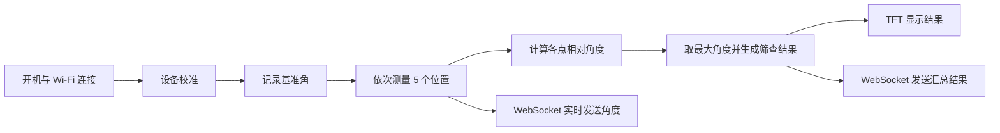

# ESP32 脊柱侧弯智能筛查仪

一套基于 ESP32 的便携式脊柱侧弯筛查仪原型固件。设备读取 JY901 姿态传感器的角度数据，通过 TFT 屏幕和实体按键完成校准与五点测量，并以 WebSocket/JSON 将测量过程和汇总结果发送给局域网内的管理平台。

> [!IMPORTANT]
> 本项目是科研与教学原型，不是医疗诊断设备。固件测量的是体表/设备姿态角，不等同于 X 光片上的 Cobb 角，也不能替代医生检查、影像学诊断或治疗建议。代码中的筛查阈值是当前固件逻辑，必须结合目标人群、测量姿势、硬件标定及临床验证后使用。

## 项目背景

传统脊柱侧弯筛查常依赖人工测量或影像检查。本项目希望提供一种便携、无电离辐射、可联网的数据采集原型，用于现场初筛和随访记录。配套项目还规划了连续滚轮轨迹采集、脊柱模型生成、群体统计分析和智能管理平台等能力。

这份仓库当前实现的是**设备端五点角度筛查与 WebSocket 数据上报**。连续轨迹重建、Cobb 角自动计算、云端存储和管理平台不在本仓库代码范围内。

## 已实现功能

- JY901 九轴姿态传感器串口数据解析
- 设备基准角校准
- 依次记录 5 个位置的角度及最大值
- 320 × 240 TFT 图形界面
- 三按键菜单、测量与复位操作
- 旋转编码器计数采集
- 电池/电源模拟量读取
- ESP32 连接 Wi-Fi，并通过 mDNS 发布 `spinedetector.local`
- WebSocket 服务端（默认端口 `81`）
- JSON 格式的状态、角度、结果、设备信息、心跳、错误和日志消息

## 工作流程



固件使用 JY901 的 Y 轴欧拉角：

```text
相对角度 = abs(当前 Y 轴角度 - 校准基准角)
测试结果 = 5 个测量位置相对角度的最大值
```

当前代码内置的结果映射如下。它只描述软件行为，不构成临床分级标准：

| 最大角度 | 固件结果 | 固件提示 |
| --- | --- | --- |
| `≤ 5°` | `normal` | 正常范围内 |
| `> 5° 且 ≤ 7°` | `mild` | 建议进一步 X 光检查 |
| `> 7°` | `moderate` | 建议治疗介入 |

脊柱侧弯研究学会（SRS）将脊柱侧弯仪读数描述为对躯干旋转的粗略估计，并将 5°–7° 作为阳性筛查/转诊阈值范围；脊柱侧弯的临床诊断仍依据站立位影像上的 Cobb 角等专业评估。参见 [SRS 早期筛查立场声明](https://www.srs.org/About-SRS/Quality-and-Safety/Position-Statements/Screening-for-the-Early-Detection-for-Idiopathic-Scoliosis-in-Adolescents) 与 [SRS 诊断说明](https://www.srs.org/Patients/Diagnosis-And-Treatment/Diagnosing-Scoliosis)。

## 硬件与接口

| 模块 | 连接/引脚 | 代码用途 |
| --- | --- | --- |
| ESP32 开发板 | `esp32dev` | 主控、Wi-Fi、WebSocket |
| JY901 姿态传感器 | `Serial1`，RX=`GPIO25`，TX=`GPIO26`，115200 baud | 读取姿态角 |
| TFT 屏幕 | 由 TFT_eSPI 配置决定 | 320 × 240 UI 显示 |
| 按键 1 | `GPIO22` | 确认、校准、记录测量点 |
| 按键 2 | `GPIO35` | 菜单切换/下一页 |
| 按键 3 | `GPIO21` | 返回主页并重置测试 |
| 旋转编码器 A/B | `GPIO17` / `GPIO16` | 行程计数 |
| 电源控制 | `GPIO19` | 电源保持/关闭逻辑 |
| 电池采样 | `GPIO34` | 模拟电压读取 |

> [!NOTE]
> TFT_eSPI 的显示驱动型号和 SPI 引脚通常配置在库的 `User_Setup.h` 或自定义 setup 中，本仓库没有包含该板级配置。首次移植时请根据实际屏幕和 PCB 原理图补齐。ESP32 的 GPIO35 是输入专用引脚，且没有内部上拉；实际电路需提供外部上拉/下拉。

## 软件栈

- [PlatformIO](https://platformio.org/)
- Arduino framework for ESP32
- TFT_eSPI `^2.5.43`
- Ucglib `^1.5.2`
- OneButton `^2.5.0`
- WebSockets `^2.3.7`
- ArduinoJson `^6.21.3`

依赖版本已声明在 [`platformio.ini`](platformio.ini) 中。

## 快速开始

### 1. 准备环境

安装 [Visual Studio Code](https://code.visualstudio.com/) 和 [PlatformIO IDE](https://platformio.org/install/ide?install=vscode)，然后克隆本仓库。

### 2. 配置网络

项目不会提交真实 Wi-Fi 凭据。复制配置模板：

```bash
cp src/config.example.h src/config.h
```

编辑 `src/config.h`：

```cpp
#define WIFI_SSID "your-wifi-ssid"
#define WIFI_PASSWORD "your-wifi-password"
#define WEBSOCKET_PORT 81
#define DEVICE_ID "SpineDetector"
#define FIRMWARE_VERSION "1.0.0"
```

### 3. 编译与烧录

```bash
pio run
pio run --target upload
pio device monitor --baud 9600
```

也可以在 PlatformIO IDE 中使用 **Build**、**Upload** 和 **Serial Monitor**。

### 4. 连接设备

设备成功联网后，局域网内的 WebSocket 客户端可连接：

```text
ws://spinedetector.local:81
```

若客户端环境不支持 mDNS，请从串口日志读取设备 IP，并使用：

```text
ws://<device-ip>:81
```

## 设备操作

1. 上电，按键 1 进入主界面。
2. 在主菜单中选择校准页面，将设备置于基准姿态后按键 1。
3. 进入测试页面，在预定的 5 个位置依次按键 1 采样。
4. 第 5 次采样后，屏幕显示最大角度，设备发送 `test_complete` 消息。
5. 按键 3 返回主页并清空本次测试状态。

## WebSocket 接口

设备是 WebSocket 服务端，管理平台是客户端。设备端操作不依赖后台控制，后台主要负责接收、关联与存储数据。

客户端可以在连接后发送：

```json
{
  "type": "connect"
}
```

设备可能发送以下消息类型：

| `type` | 说明 |
| --- | --- |
| `welcome` | 连接欢迎信息、设备 ID、固件版本 |
| `status` | 连接、校准、测试状态 |
| `angle_data` | 位置编号和单点角度 |
| `test_complete` | 最大角度、筛查结果和提示 |
| `device_info` | IP、MAC、运行时间、内存、RSSI |
| `heartbeat` | 每 10 秒发送的存活与内存信息 |
| `error` | 错误码和错误信息 |
| `log` | 设备运行日志 |

完整字段、示例和通信时序见 [`ESP32_WebSocket_API.md`](ESP32_WebSocket_API.md)。

## 项目结构

```text
.
├── platformio.ini                 # PlatformIO 工程与依赖配置
├── ESP32_WebSocket_API.md         # WebSocket/JSON 协议文档
├── include/                       # PlatformIO 公共头文件目录
├── lib/                           # PlatformIO 私有库目录
├── src/
│   ├── main.cpp                   # UI、按键、传感器、测量主流程
│   ├── SpineDetectorWebSocket.*   # Wi-Fi、mDNS、WebSocket 通信
│   ├── JY901.*                    # JY901 串口/I²C 数据解析
│   ├── JY901_regs.h               # JY901 寄存器定义
│   ├── Encoder.*                  # 旋转编码器计数
│   ├── config.example.h           # 可公开的配置模板
│   ├── cz.h                       # TFT 界面位图资源
│   └── dog.h                      # 图像资源
└── test/                          # PlatformIO 测试目录（待补充）
```

## 当前限制与后续方向

- 当前测试只保存 5 个离散角度点，编码器计数尚未用于位置标定或连续轨迹重建。
- 尚未实现 PPT 方案中描述的椎骨位置估计、三维/二维脊柱模型生成或 Cobb 角自动计算。
- TFT_eSPI 板级配置、PCB 原理图、外壳模型和后台管理平台不在本仓库中。
- 设备时间戳来自 ESP32 启动后的 `millis()`，不是 Unix 时间。
- WebSocket 当前未启用 TLS、鉴权或访问控制，只适合可信局域网和原型测试。
- 需要补充传感器标定、重复性/一致性实验、异常处理、单元测试与临床验证。

建议的迭代方向：

1. 将编码器行程与姿态角同步采样，建立距离—角度曲线。
2. 增加滤波、零偏补偿、重复测量和传感器故障检测。
3. 明确测量姿势与标准操作流程，开展与专业脊柱侧弯仪及影像结果的对照实验。
4. 为 WebSocket 增加会话标识、数据序号、校验、鉴权与安全传输。
5. 拆分 UI 状态机、测量逻辑和通信层，并补充自动化测试。

## 安全与隐私

- 不要把 `src/config.h`、真实 Wi-Fi 密码或后台凭据提交到 Git。
- 设备会广播 MAC、IP、角度和运行状态；管理平台应限制访问并妥善保护受试者数据。
- 本仓库的消息本身不包含用户身份，用户与测量记录的关联应由授权的后台系统完成。

## 许可证

本仓库目前未声明开源许可证。在添加明确的 `LICENSE` 文件前，请勿假定代码、UI 素材或设计可以被自由复制、修改或用于商业用途。
